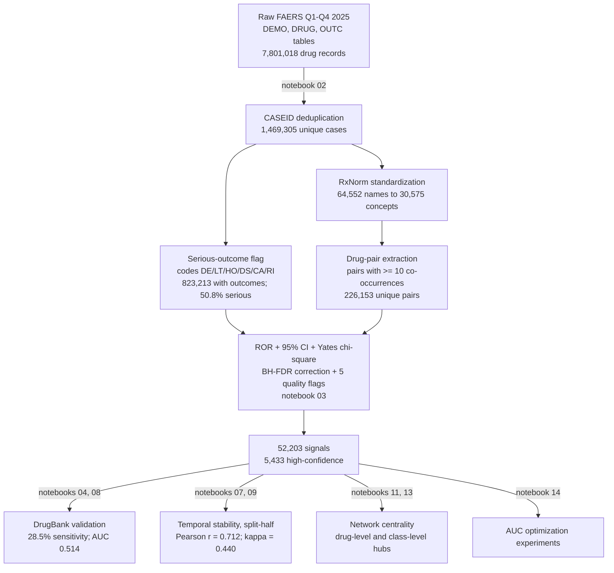

# FAERS Drug-Drug Interaction Signal Detection

Signal detection for drug-drug interactions (DDIs) in the FDA Adverse Event Reporting System (FAERS), using all four quarters of 2025 data. The analysis computes Reporting Odds Ratios (ROR) for co-prescribed drug pairs, controls the false discovery rate, validates signals against DrugBank, tests temporal stability across the year, and characterizes the interaction network.

This repository covers the thesis analysis (notebooks 02 through 14). Notebook 01 is a separate course-project component on Q2 2025 only and is not part of the thesis pipeline.

## Pipeline at a Glance



## Key Results

- 1,469,305 deduplicated patient reports across Q1-Q4 2025; 823,213 with outcome data (50.8% serious)
- 226,153 unique drug pairs analyzed (each with >= 10 co-occurrences)
- 52,203 signals (ROR > 2.0, 95% CI lower bound > 1.0, FDR-adjusted p < 0.05)
- 5,433 high-confidence signals (zero quality flags and N >= 100)
- DrugBank validation (full FAERS drug universe): 28.5% sensitivity [28.0%, 28.9%], 53.4% restricted to definitive calls, 56.8% specificity, 22.0% PPV, 84.2% NPV
- Temporal stability (split-half, Q1+Q2 vs Q3+Q4): Pearson r = 0.712, Spearman rho = 0.622, Cohen's kappa = 0.440, replication rate 80.3% among signals
- 300 prioritized signals reviewed: 81 confirmed in DrugBank, 61 cleaned novel candidates

The DrugBank-membership AUC for ROR magnitude is 0.514. This is a real result, not an artifact: FAERS disproportionality and DrugBank capture complementary interaction types (pharmacodynamic safety signals versus pharmacokinetic catalog entries), so ROR magnitude does not rank DrugBank membership. The appropriate summary is the operating-point validation above rather than the AUC. See notebook 14 for the supporting experiments.

## Repository Structure

```
FDA_Project/
  notebooks/        Numbered analysis notebooks (02-14), run in order
  data/
    raw/            Source data (DrugBank reference, ATC mapping)
    intermediate/   Pipeline intermediates (demographics, outcomes, drug pairs)
    signals/        ROR and signal-detection outputs
    validated/      DrugBank validation and novel-signal outputs
    cache/          RxNorm and ATC API caches (do not delete)
  results/          Analysis result tables (temporal stability, validation, centrality)
  figures/thesis/   Publication-ready figures
  network/          Gephi network files
```

## Data Sources

| Source | Access | Use |
|--------|--------|-----|
| [FDA FAERS](https://fis.fda.gov/extensions/FPD-QDE-FAERS/FPD-QDE-FAERS.html) | Public | Q1-Q4 2025 ASCII quarterly extracts |
| [NLM RxNorm / RxNav API](https://rxnav.nlm.nih.gov/REST) | Public | Drug name standardization |
| [NLM RxClass API](https://rxnav.nlm.nih.gov/RxClassAPIs.html) | Public | ATC therapeutic-class mapping |
| [DrugBank](https://go.drugbank.com/) | Licensed | DDI validation reference (not redistributed here) |

## Reproducing the Analysis

### Prerequisites

```
pip install pandas numpy scikit-learn scipy statsmodels matplotlib seaborn networkx
```

### Steps

1. Download the FAERS Q1-Q4 2025 ASCII files from the FDA link above and update the raw data paths in notebook 02.
2. (Optional) Obtain the DrugBank XML release for validation (free academic license).
3. Run the notebooks in numerical order (02 through 14). The RxNorm mapping step queries the RxNav API on first run and caches results to `data/cache/`, so later runs are fast.

Reproducibility: a fixed seed (`random.seed(42)`) makes the one stochastic step (down-sampling patients with more than 20 drugs) deterministic; all other steps are deterministic, and API responses are cached.

## Methods Summary

- Reporting Odds Ratio per pair from a 2x2 table of serious versus non-serious reporting, with a log-normal 95% CI and a Yates-corrected chi-square test
- Benjamini-Hochberg false discovery rate correction across all tested pairs
- Three-criterion signal definition (ROR > 2.0, CI lower bound > 1.0, FDR p < 0.05) plus five quality flags; high-confidence signals carry zero flags and N >= 100
- DrugBank validation over the full FAERS drug universe with salt-stripped, symmetrized name matching
- Temporal stability by split-half re-estimation with Pearson, Spearman, Cohen's kappa, and a mixed-effects model
- Network analysis with degree, betweenness, and eigenvector centrality at the drug and therapeutic-class levels

## Known Limitations

- FAERS is a voluntary reporting system, so results are subject to reporting bias and an unknown exposure denominator
- Disproportionality (ROR) indicates statistical association, not causation
- Confounding by indication is endemic; for example, the most extreme RORs are dominated by drug combinations used in severely ill patients
- A pair-versus-database ROR does not isolate the interaction effect, so it is a coarse DDI proxy
- International drug name variants leave some names unmapped (RxNorm mapped 91.9% of unique strings)
- DrugBank-derived data is not redistributed here due to licensing restrictions
